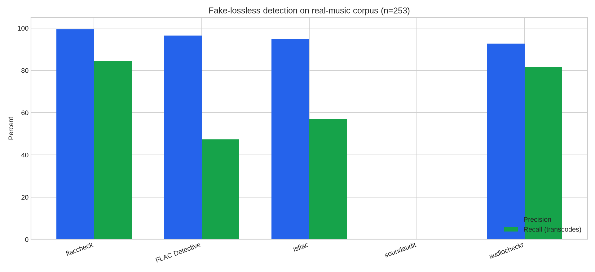
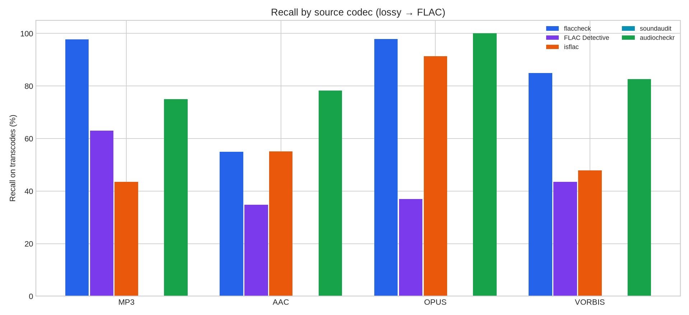
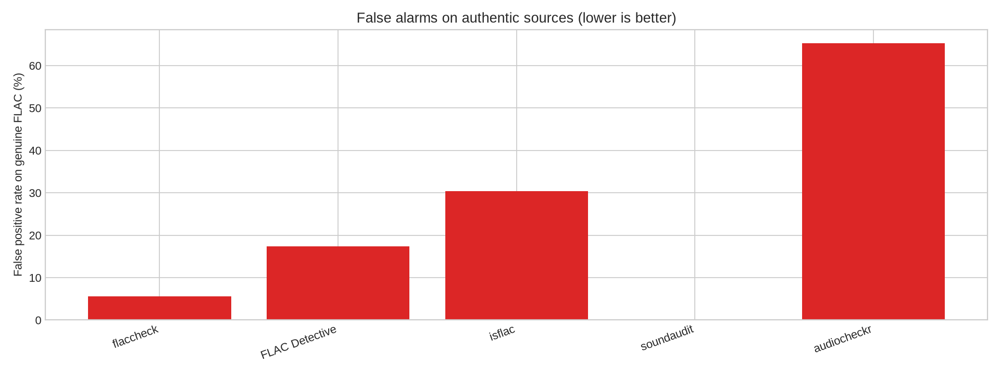

# flaccheck — detect fake FLAC files (MP3/AAC transcodes)

[](https://github.com/dasunNimantha/flaccheck/actions/workflows/ci.yml)
[](LICENSE)
[](https://www.rust-lang.org/)

**flaccheck** is a fast, open-source tool that tells you whether a FLAC (or other lossless file) is **genuinely lossless** or a **lossy transcode in disguise** — for example MP3, AAC, Opus, or Vorbis re-encoded as FLAC.

Scan a single track, an entire music library, or use the built-in web UI. No upload to the cloud: analysis runs locally on your machine.

---

## Table of contents

- [Why fake lossless matters](#why-fake-lossless-matters)
- [How flaccheck works](#how-flaccheck-works)
- [Quick start](#quick-start)
- [Usage](#usage)
- [Web UI](#web-ui)
- [Verdicts](#verdicts)
- [Supported formats](#supported-formats)
- [Benchmarks](#benchmarks)
- [FAQ](#faq)
- [Limitations](#limitations)
- [Development](#development)
- [License](#license)

---

## Why fake lossless matters

Lossless audio (FLAC, ALAC, WAV) preserves every sample from the original. Lossy codecs (MP3, AAC, Opus) throw away information to save space. Re-wrapping a 128 kbps MP3 as FLAC does **not** restore quality — you get a larger file with the same audible artifacts.

Fake lossless shows up in:

- Downloaded "FLAC" albums from untrusted sources
- Upsampled or mislabeled hi-res releases
- Marketplace listings that claim lossless but ship transcodes

**flaccheck** answers the question audiophiles and archivists ask every day: *is this file actually lossless?*

---

## How flaccheck works

flaccheck does not trust file extensions or tags. It decodes audio and runs **research-backed forensic detectors**:

| Tier | Method | What it catches |
|------|--------|-----------------|
| 1 | Spectral cutoff & brick-wall fingerprint | MP3/AAC/Opus frequency cliffs |
| 2 | MDCT quantization residual | Lossy codec block structure |
| 3 | Pre-echo, phase, joint-stereo artifacts | MP3/AAC encoder signatures |
| 4 | Fake hi-res (upsample, padded bit depth) | "24-bit" files with 16-bit content |
| 5 | Abstention on band-limited content | Old recordings, narrow masters |

Evidence from multiple tiers is fused into a single verdict with optional per-detector explanations (`--explain`).

References: D'Alessandro & Shi (ACM MM&Sec 2009), Derrien (JAES 2019), Lacroix et al. (AES 2015).

---

## Quick start

### Install

**Requirements:** [Rust](https://rustlang.org/tools/install) stable (2021 edition). Optional: [ffmpeg](https://ffmpeg.org/) for APE, WavPack, and Opus.

```bash
git clone https://github.com/dasunNimantha/flaccheck.git
cd flaccheck
cargo build --release -p flaccheck
```

Binary: `target/release/flaccheck`

Install to `~/.cargo/bin`:

```bash
cargo install --path crates/flaccheck-cli
```

### Scan your first file

```bash
flaccheck scan track.flac
```

Example output:

```
┌─────────────┬────────────┬──────────┬─────────────┐
│ File        │ Verdict    │ Codec    │ Confidence  │
├─────────────┼────────────┼──────────┼─────────────┤
│ track.flac  │ TRANSCODED │ mp3~128k │ high        │
└─────────────┴────────────┴──────────┴─────────────┘
```

---

## Usage

```bash
# Single file (colored table)
flaccheck scan track.flac

# Entire library — parallel workers
flaccheck scan ~/Music --workers 8

# HTML report for sharing
flaccheck scan ~/Music --format html -o report.html

# JSON for scripts and automation
flaccheck scan album.flac --format json --quiet -o results.json

# Deep analysis with detector evidence
flaccheck scan track.flac --mode max --explain

# Fast sweep (spectral + hi-res only)
flaccheck scan ~/Music --mode fast

# Benchmark against a labeled manifest
flaccheck benchmark manifest.json --mode balanced -o metrics.json
```

### Scan modes

| Mode | Detectors | Best for |
|------|-----------|----------|
| `fast` | Spectral + hi-res + light artifacts | Large libraries, first pass |
| `balanced` | + quantization on suspects, full artifacts | **Default** — good speed/recall |
| `max` | Exhaustive quantization search on every file | Suspicious files, archival QA |

### Output formats

`text` (default), `json`, `csv`, `html`

---

## Web UI

Drag-and-drop analysis in the browser — no CLI required:

```bash
flaccheck serve
# → http://127.0.0.1:8787
```

Upload FLAC, WAV, or other supported files and get instant verdicts with spectral charts.

---

## Verdicts

| Verdict | Meaning |
|---------|---------|
| **GENUINE** | No strong evidence of lossy transcoding |
| **SUSPICIOUS** | Some lossy indicators; may be high-bitrate transcode |
| **TRANSCODED** | Strong lossy fingerprint (e.g. MP3 brick wall at 16 kHz) |
| **INCONCLUSIVE** | Source is too band-limited to judge reliably |

`GENUINE` means *no transcoding evidence was found* — not a cryptographic proof of provenance.

---

## Supported formats

**Native decode (symphonia):** FLAC, WAV, AIFF, ALAC, AAC, MP3, Vorbis

**With ffmpeg installed:** APE, WavPack, Opus

---

## Benchmarks

Compared on **two independent real-music corpora** pooled into **253 labeled files** (23 genuine FLAC references + 230 lossy→FLAC transcodes via ffmpeg: MP3, AAC, Opus, Vorbis). Corpus v1 uses archival/classical sources; corpus v2 uses fresh etree live and netlabel FLACs from the Internet Archive (no overlap). All tools ran locally on identical files; a positive call means **fake / suspicious / transcode detected**. Versions: flaccheck 0.1, [FLAC Detective](https://pypi.org/project/flac-detective/) 1.7, [isflac](https://github.com/temidaradev/isflac) 0.1.4, [soundaudit](https://pypi.org/project/soundaudit/) 0.1.2, [audiocheckr](https://github.com/abalajiksh/audiocheckr) 0.3.7.

**Not included:** Spek (manual spectrogram only), auCDtect (legacy, hard to run on modern Linux).

### Overall detection quality



| Tool | Precision | Recall | False positives on genuine |
|------|-----------|--------|----------------------------|
| **flaccheck** (balanced) | **99%** | **85%** | **4%** (1/23) |
| [audiocheckr](https://github.com/abalajiksh/audiocheckr) 0.3.7 | 93% | **82%** | 65% (15/23) |
| [isflac](https://github.com/temidaradev/isflac) 0.1.4 | 95% | 57% | 30% (7/23) |
| [FLAC Detective](https://pypi.org/project/flac-detective/) 1.7 | 97% | 47% | 17% (4/23) |
| [soundaudit](https://pypi.org/project/soundaudit/) 0.1.2 | — | 0% | 0% |

**Takeaway:** flaccheck has the **highest precision** (one false positive across 23 genuine references) while matching or beating alternatives on recall. audiocheckr catches more borderline transcodes but flags most genuine references as fake. soundaudit's spectral pass did not detect any transcodes here — its ffmpeg filter chain fails on ffmpeg 7.x (`highpass=poles=4` is out of range), so treat its 0% recall as an environment limitation, not a fair capability score.

flaccheck abstains with `INCONCLUSIVE` on 22 band-limited files rather than guessing (counted as recall misses).

### Recall by source codec



| Codec | flaccheck | audiocheckr | isflac | FLAC Detective |
|-------|-----------|-------------|--------|----------------|
| MP3 | **98%** | 75% | 43% | 63% |
| AAC | 55% | **78%** | 55% | 35% |
| Opus | **98%** | **100%** | 91% | 37% |
| Vorbis | **85%** | 83% | 48% | 43% |

### False alarms on authentic sources



Lower is better. flaccheck returned `INCONCLUSIVE` on narrow-bandwidth genuine masters instead of marking them transcodes.

### Reproduce

```bash
# 1. Build corpora (needs ffmpeg)
./datasets/generate_realistic.sh /path/to/v1/sources datasets/output/realistic
./datasets/download_benchmark_v2.sh
./datasets/generate_realistic.sh datasets/benchmark_v2_sources datasets/output/benchmark_v2

# 2. Primary tools (repeat per corpus, outputs in benchmarks/ and benchmarks_v2/)
cargo build --release -p flaccheck
./target/release/flaccheck scan datasets/output/realistic --format json --quiet \
  -o benchmarks/flaccheck_per_file.json --workers 8
flac-detective --format json --output benchmarks/flac_detective.json datasets/output/realistic
# same for datasets/output/benchmark_v2 → benchmarks_v2/

# 3. Additional comparators (isflac, soundaudit, audiocheckr) — per corpus
cargo install isflac
pip install soundaudit matplotlib
git clone https://github.com/abalajiksh/audiocheckr benchmarks/vendor/audiocheckr
# isolate from workspace: prepend `[workspace]\n` to benchmarks/vendor/audiocheckr/Cargo.toml
cargo build --release --manifest-path benchmarks/vendor/audiocheckr/Cargo.toml

python3 scripts/benchmark_compare.py --collect   # per corpus; slow (~5 min each)
python3 scripts/benchmark_compare.py --combine   # merged report + charts
```

Raw numbers: [`docs/benchmarks/comparison.json`](docs/benchmarks/comparison.json)
Optional ML refinement for borderline files:

```bash
cargo build --release -p flaccheck --features ml
flaccheck scan --ml --model models/borderline.onnx track.flac
```

---

## FAQ

### How do I know if my FLAC is fake?

Decode and inspect the spectrum. Lossy transcodes show a sharp **frequency cliff** (brick wall) where the encoder cut off high frequencies — typically 16–20 kHz for MP3, or a gentle shelf for AAC. flaccheck automates this plus deeper codec fingerprinting.

### Can flaccheck detect MP3 converted to FLAC?

Yes. MP3 transcodes are the strongest case — **98% recall** on the combined benchmark corpora (see [Benchmarks](#benchmarks)).

### Does flaccheck work on Apple Lossless (ALAC) or WAV?

Yes. Any container format flaccheck can decode is analyzed the same way. The question is whether the *audio content* shows lossy encoding fingerprints, not the file extension.

### Is flaccheck better than Spek or Audacity?

Spek shows a spectrogram for manual inspection. flaccheck **automates** multi-tier detection, scores confidence, batch-scans directories, and outputs structured reports (JSON/CSV/HTML). On our combined benchmark corpora, flaccheck has the **highest precision** among automated tools (one false positive on 23 genuine references) — see [Benchmarks](#benchmarks). Use both: flaccheck for library sweeps, a spectrogram viewer to visually confirm edge cases.

### Does it upload my music anywhere?

No. All analysis is **local**. The web UI (`flaccheck serve`) binds to `127.0.0.1` by default.

### What about high-bitrate AAC or 320 kbps MP3?

These are harder. A 320 kbps MP3 may only show subtle artifacts; AAC 256 kbps can sit near Nyquist. flaccheck may return `SUSPICIOUS` rather than a hard `TRANSCODED` verdict — that is intentional.

---

## Limitations

- **Not a provenance guarantee** — `GENUINE` means no lossy fingerprint, not "ripped from original CD."
- **Band-limited sources** (78 rpm transfers, AM radio recordings, narrow masters) may be `INCONCLUSIVE`.
- **High-bitrate lossy** (AAC 256k, MP3 V0) is an inherently ambiguous zone.
- **AAC recall** is lower than MP3/Opus; gentle spectral shelves are harder than brick walls.
- Tier 2 thresholds are calibrated on ffmpeg transcode matrices; your sources may differ.

---

## Development

```bash
cargo fmt --check
cargo clippy --workspace --all-targets -- -D warnings
cargo test --workspace
cargo build --release -p flaccheck
```

Research notes and ML training: [`research/README.md`](research/README.md).

---

## License

MIT — see [LICENSE](LICENSE).
